# EchoMox Technical Architecture Documentation

## Table of Contents

1. [System Overview](#system-overview)
2. [High-Level Architecture](#high-level-architecture)
3. [Core Components](#core-components)
4. [Reservoir Computing Integration](#reservoir-computing-integration)
5. [Email Processing Flow](#email-processing-flow)
6. [Data Architecture](#data-architecture)
7. [Network Architecture](#network-architecture)
8. [Security Architecture](#security-architecture)
9. [Deployment Architecture](#deployment-architecture)

---

## System Overview

EchoMox is an advanced mail server that extends the mox mail server with cutting-edge reservoir computing capabilities. It combines traditional email server functionality with machine learning-based spam filtering using Echo State Networks (ESN), Membrane Computing (P-Systems), and Affective Computing.

### Key Features
- **Modern Mail Server**: Full-featured SMTP/IMAP server with webmail
- **Reservoir Computing**: Advanced AI-powered spam filtering
- **Security First**: SPF, DKIM, DMARC, MTA-STS, DANE support
- **Easy Management**: Web-based administration interface
- **Self-Hosted**: Complete control over your email infrastructure

### Technology Stack
- **Language**: Go 1.23+
- **Database**: BoltDB (embedded key-value store)
- **Frontend**: TypeScript, vanilla JavaScript
- **Protocols**: SMTP, IMAP4, HTTP/HTTPS
- **ML Framework**: Custom reservoir computing implementation

---

## High-Level Architecture

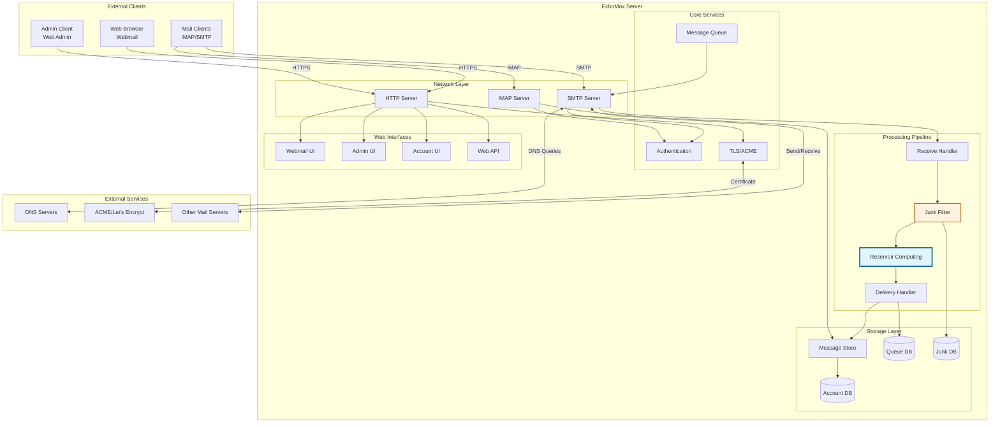
```mermaid
graph TB
    subgraph "External Clients"
        MC[Mail Clients<br/>IMAP/SMTP]
        WB[Web Browser<br/>Webmail]
        AC[Admin Client<br/>Web Admin]
    end

    subgraph "EchoMox Server"
        subgraph "Network Layer"
            SMTP[SMTP Server]
            IMAP[IMAP Server]
            HTTP[HTTP Server]
        end

        subgraph "Core Services"
            AUTH[Authentication]
            TLS[TLS/ACME]
            QUEUE[Message Queue]
        end

        subgraph "Processing Pipeline"
            RCV[Receive Handler]
            FILTER[Junk Filter]
            RESERVOIR[Reservoir Computing]
            DELIVER[Delivery Handler]
        end

        subgraph "Storage Layer"
            MSGSTORE[Message Store]
            ACCDB[(Account DB)]
            QUEUEDB[(Queue DB)]
            JUNKDB[(Junk DB)]
        end

        subgraph "Web Interfaces"
            WEBMAIL[Webmail UI]
            WEBADMIN[Admin UI]
            WEBACCT[Account UI]
            WEBAPI[Web API]
        end
    end

    subgraph "External Services"
        DNS[DNS Servers]
        ACME[ACME/Let's Encrypt]
        MTA[Other Mail Servers]
    end

    MC -->|IMAP| IMAP
    MC -->|SMTP| SMTP
    WB -->|HTTPS| HTTP
    AC -->|HTTPS| HTTP

    SMTP --> AUTH
    IMAP --> AUTH
    HTTP --> TLS

    SMTP --> RCV
    RCV --> FILTER
    FILTER --> RESERVOIR
    RESERVOIR --> DELIVER
    DELIVER --> MSGSTORE

    IMAP --> MSGSTORE
    
    HTTP --> WEBMAIL
    HTTP --> WEBADMIN
    HTTP --> WEBACCT
    HTTP --> WEBAPI

    QUEUE --> SMTP
    SMTP <-->|Send/Receive| MTA

    TLS <-->|Certificate| ACME
    SMTP <-->|DNS Queries| DNS
    
    MSGSTORE --> ACCDB
    DELIVER --> QUEUEDB
    FILTER --> JUNKDB

    style RESERVOIR fill:#e1f5ff,stroke:#01579b,stroke-width:3px
    style FILTER fill:#fff3e0,stroke:#e65100,stroke-width:2px
```

### System Context

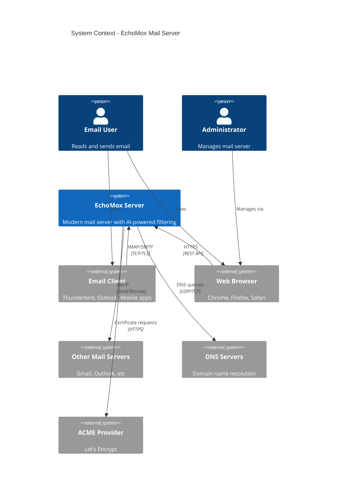
```mermaid
C4Context
    title System Context - EchoMox Mail Server

    Person(user, "Email User", "Reads and sends email")
    Person(admin, "Administrator", "Manages mail server")
    
    System(echomox, "EchoMox Server", "Modern mail server with AI-powered filtering")
    
    System_Ext(client, "Email Client", "Thunderbird, Outlook, Mobile apps")
    System_Ext(browser, "Web Browser", "Chrome, Firefox, Safari")
    System_Ext(mailserver, "Other Mail Servers", "Gmail, Outlook, etc")
    System_Ext(dns, "DNS Servers", "Domain name resolution")
    System_Ext(acme, "ACME Provider", "Let's Encrypt")

    Rel(user, client, "Uses")
    Rel(user, browser, "Uses")
    Rel(admin, browser, "Manages via")
    
    Rel(client, echomox, "IMAP/SMTP", "TCP/TLS")
    Rel(browser, echomox, "HTTPS", "REST API")
    Rel(echomox, mailserver, "SMTP", "Send/Receive")
    Rel(echomox, dns, "DNS queries", "UDP/TCP")
    Rel(echomox, acme, "Certificate requests", "HTTPS")

    UpdateLayoutConfig($c4ShapeInRow="3", $c4BoundaryInRow="1")
```

---

## Core Components

### Component Architecture

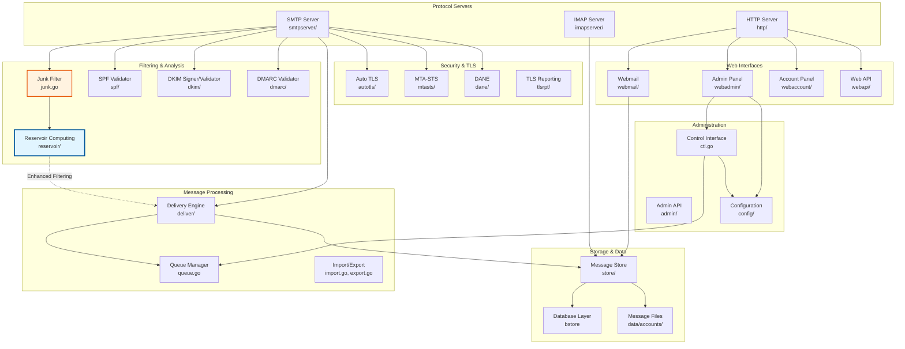
```mermaid
graph TB
    subgraph "Protocol Servers"
        SMTP[SMTP Server<br/>smtpserver/]
        IMAP[IMAP Server<br/>imapserver/]
        HTTP[HTTP Server<br/>http/]
    end

    subgraph "Message Processing"
        QUEUE[Queue Manager<br/>queue.go]
        DELIVER[Delivery Engine<br/>deliver/]
        IMPORT[Import/Export<br/>import.go, export.go]
    end

    subgraph "Filtering & Analysis"
        JUNK[Junk Filter<br/>junk.go]
        SPF[SPF Validator<br/>spf/]
        DKIM[DKIM Signer/Validator<br/>dkim/]
        DMARC[DMARC Validator<br/>dmarc/]
        RESERVOIR[Reservoir Computing<br/>reservoir/]
    end

    subgraph "Storage & Data"
        STORE[Message Store<br/>store/]
        DB[Database Layer<br/>bstore]
        MSGFILES[Message Files<br/>data/accounts/]
    end

    subgraph "Administration"
        CTL[Control Interface<br/>ctl.go]
        ADMIN[Admin API<br/>admin/]
        CONFIG[Configuration<br/>config/]
    end

    subgraph "Security & TLS"
        AUTOTLS[Auto TLS<br/>autotls/]
        MTASTS[MTA-STS<br/>mtasts/]
        DANE[DANE<br/>dane/]
        TLSRPT[TLS Reporting<br/>tlsrpt/]
    end

    subgraph "Web Interfaces"
        WEBMAIL[Webmail<br/>webmail/]
        WEBADMIN[Admin Panel<br/>webadmin/]
        WEBACCT[Account Panel<br/>webaccount/]
        WEBAPI[Web API<br/>webapi/]
    end

    SMTP --> JUNK
    SMTP --> SPF
    SMTP --> DKIM
    SMTP --> DMARC
    
    JUNK --> RESERVOIR
    RESERVOIR -.->|Enhanced Filtering| DELIVER
    
    SMTP --> DELIVER
    DELIVER --> QUEUE
    DELIVER --> STORE
    
    IMAP --> STORE
    STORE --> DB
    STORE --> MSGFILES
    
    HTTP --> WEBMAIL
    HTTP --> WEBADMIN
    HTTP --> WEBACCT
    HTTP --> WEBAPI
    
    WEBMAIL --> STORE
    WEBADMIN --> CTL
    WEBADMIN --> CONFIG
    
    SMTP --> AUTOTLS
    SMTP --> MTASTS
    SMTP --> DANE
    
    CTL --> QUEUE
    CTL --> CONFIG

    style RESERVOIR fill:#e1f5ff,stroke:#01579b,stroke-width:3px
    style JUNK fill:#fff3e0,stroke:#e65100,stroke-width:2px
```

### Component Details

| Component | Package | Description | Key Features |
|-----------|---------|-------------|--------------|
| SMTP Server | `smtpserver/` | Handles incoming SMTP connections | STARTTLS, AUTH, PIPELINING, DSN |
| IMAP Server | `imapserver/` | Provides IMAP4 access to mailboxes | IDLE, MOVE, LITERAL+, QRESYNC |
| HTTP Server | `http/` | Serves web interfaces and APIs | TLS, compression, reverse proxy |
| Queue Manager | `queue.go` | Manages outgoing message queue | Retry logic, DSN generation |
| Junk Filter | `junk.go` | Bayesian spam filtering | Per-user learning, reputation tracking |
| Reservoir Computing | `reservoir/` | AI-powered spam detection | ESN, P-Systems, Affective Computing |
| Message Store | `store/` | Persistent message storage | Efficient indexing, search |
| Admin Control | `ctl.go` | Runtime management interface | Account management, queue control |

---

## Reservoir Computing Integration

### Reservoir Computing Architecture

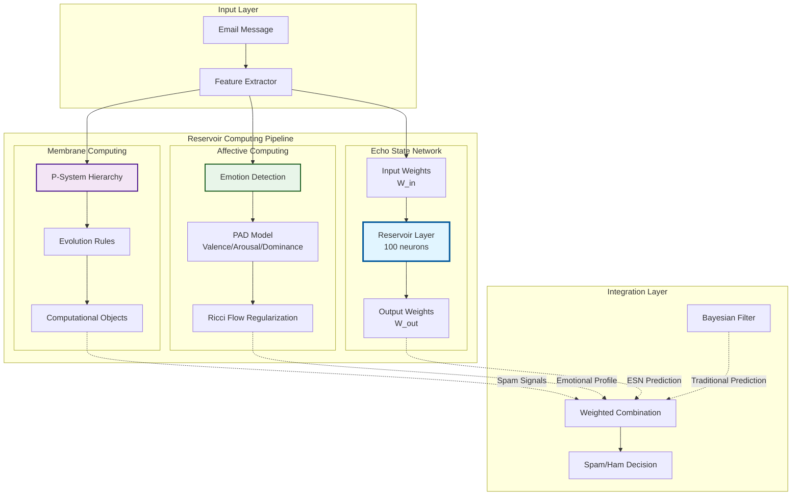
```mermaid
graph TB
    subgraph "Input Layer"
        EMAIL[Email Message]
        FEATURES[Feature Extractor]
    end

    subgraph "Reservoir Computing Pipeline"
        subgraph "Echo State Network"
            INPUT[Input Weights<br/>W_in]
            RESERVOIR[Reservoir Layer<br/>100 neurons]
            OUTPUT[Output Weights<br/>W_out]
        end

        subgraph "Membrane Computing"
            MEMBRANE[P-System Hierarchy]
            RULES[Evolution Rules]
            OBJECTS[Computational Objects]
        end

        subgraph "Affective Computing"
            EMOTION[Emotion Detection]
            PAD[PAD Model<br/>Valence/Arousal/Dominance]
            RICCI[Ricci Flow Regularization]
        end
    end

    subgraph "Integration Layer"
        BAYESIAN[Bayesian Filter]
        COMBINE[Weighted Combination]
        DECISION[Spam/Ham Decision]
    end

    EMAIL --> FEATURES
    FEATURES --> INPUT
    FEATURES --> MEMBRANE
    FEATURES --> EMOTION

    INPUT --> RESERVOIR
    RESERVOIR --> OUTPUT

    MEMBRANE --> RULES
    RULES --> OBJECTS
    OBJECTS -.->|Spam Signals| COMBINE

    EMOTION --> PAD
    PAD --> RICCI
    RICCI -.->|Emotional Profile| COMBINE

    OUTPUT -.->|ESN Prediction| COMBINE
    BAYESIAN -.->|Traditional Prediction| COMBINE
    COMBINE --> DECISION

    style RESERVOIR fill:#e1f5ff,stroke:#01579b,stroke-width:3px
    style MEMBRANE fill:#f3e5f5,stroke:#4a148c,stroke-width:2px
    style EMOTION fill:#e8f5e9,stroke:#1b5e20,stroke-width:2px
```

### Echo State Network (ESN) Details

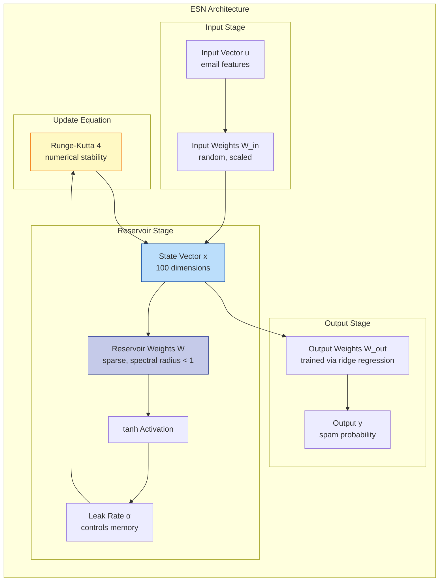
```mermaid
graph LR
    subgraph "ESN Architecture"
        subgraph "Input Stage"
            u[Input Vector u<br/>email features]
            Win[Input Weights W_in<br/>random, scaled]
        end

        subgraph "Reservoir Stage"
            x[State Vector x<br/>100 dimensions]
            W[Reservoir Weights W<br/>sparse, spectral radius < 1]
            activation[tanh Activation]
            leak[Leak Rate α<br/>controls memory]
        end

        subgraph "Output Stage"
            Wout[Output Weights W_out<br/>trained via ridge regression]
            y[Output y<br/>spam probability]
        end

        subgraph "Update Equation"
            RK4[Runge-Kutta 4<br/>numerical stability]
        end
    end

    u --> Win
    Win --> x
    x --> W
    W --> activation
    activation --> leak
    leak --> RK4
    RK4 --> x
    x --> Wout
    Wout --> y

    style x fill:#bbdefb,stroke:#0d47a1
    style W fill:#c5cae9,stroke:#283593
    style RK4 fill:#fff9c4,stroke:#f57f17
```

### Membrane Computing (P-Systems)

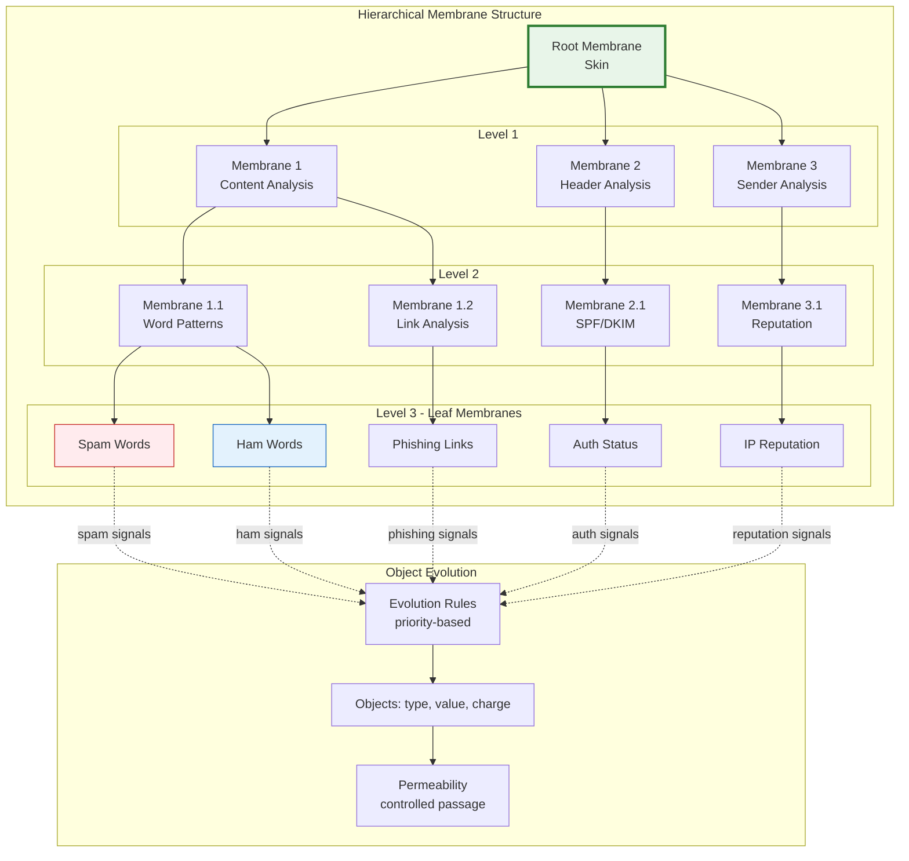
```mermaid
graph TB
    subgraph "Hierarchical Membrane Structure"
        ROOT[Root Membrane<br/>Skin]
        
        subgraph "Level 1"
            M1[Membrane 1<br/>Content Analysis]
            M2[Membrane 2<br/>Header Analysis]
            M3[Membrane 3<br/>Sender Analysis]
        end

        subgraph "Level 2"
            M11[Membrane 1.1<br/>Word Patterns]
            M12[Membrane 1.2<br/>Link Analysis]
            M21[Membrane 2.1<br/>SPF/DKIM]
            M31[Membrane 3.1<br/>Reputation]
        end

        subgraph "Level 3 - Leaf Membranes"
            M111[Spam Words]
            M112[Ham Words]
            M121[Phishing Links]
            M211[Auth Status]
            M311[IP Reputation]
        end
    end

    ROOT --> M1
    ROOT --> M2
    ROOT --> M3

    M1 --> M11
    M1 --> M12
    M2 --> M21
    M3 --> M31

    M11 --> M111
    M11 --> M112
    M12 --> M121
    M21 --> M211
    M31 --> M311

    subgraph "Object Evolution"
        OBJ[Objects: type, value, charge]
        RULES[Evolution Rules<br/>priority-based]
        PERM[Permeability<br/>controlled passage]
    end

    M111 -.->|spam signals| RULES
    M112 -.->|ham signals| RULES
    M121 -.->|phishing signals| RULES
    M211 -.->|auth signals| RULES
    M311 -.->|reputation signals| RULES

    RULES --> OBJ
    OBJ --> PERM

    style ROOT fill:#e8f5e9,stroke:#2e7d32,stroke-width:3px
    style M111 fill:#ffebee,stroke:#c62828
    style M112 fill:#e3f2fd,stroke:#1565c0
```

### Affective Computing Integration

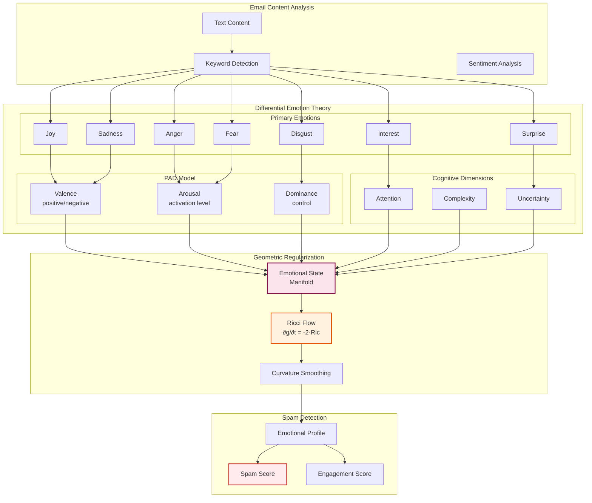
```mermaid
graph TB
    subgraph "Differential Emotion Theory"
        subgraph "Primary Emotions"
            JOY[Joy]
            SAD[Sadness]
            ANGER[Anger]
            FEAR[Fear]
            DISGUST[Disgust]
            INTEREST[Interest]
            SURPRISE[Surprise]
        end

        subgraph "PAD Model"
            V[Valence<br/>positive/negative]
            A[Arousal<br/>activation level]
            D[Dominance<br/>control]
        end

        subgraph "Cognitive Dimensions"
            ATT[Attention]
            COMP[Complexity]
            UNC[Uncertainty]
        end
    end

    subgraph "Email Content Analysis"
        TEXT[Text Content]
        KEYWORDS[Keyword Detection]
        SENTIMENT[Sentiment Analysis]
    end

    subgraph "Geometric Regularization"
        MANIFOLD[Emotional State<br/>Manifold]
        RICCI[Ricci Flow<br/>∂g/∂t = -2·Ric]
        SMOOTH[Curvature Smoothing]
    end

    subgraph "Spam Detection"
        PROFILE[Emotional Profile]
        SCORE[Spam Score]
        ENGAGE[Engagement Score]
    end

    TEXT --> KEYWORDS
    KEYWORDS --> JOY
    KEYWORDS --> SAD
    KEYWORDS --> ANGER
    KEYWORDS --> FEAR
    KEYWORDS --> DISGUST
    KEYWORDS --> INTEREST
    KEYWORDS --> SURPRISE

    JOY --> V
    SAD --> V
    ANGER --> A
    FEAR --> A
    DISGUST --> D
    INTEREST --> ATT
    SURPRISE --> UNC

    V --> MANIFOLD
    A --> MANIFOLD
    D --> MANIFOLD
    ATT --> MANIFOLD
    COMP --> MANIFOLD
    UNC --> MANIFOLD

    MANIFOLD --> RICCI
    RICCI --> SMOOTH
    SMOOTH --> PROFILE
    PROFILE --> SCORE
    PROFILE --> ENGAGE

    style MANIFOLD fill:#fce4ec,stroke:#880e4f,stroke-width:2px
    style RICCI fill:#fff3e0,stroke:#e65100,stroke-width:2px
    style SCORE fill:#ffebee,stroke:#c62828,stroke-width:2px
```

---

## Email Processing Flow

### Incoming Email Flow

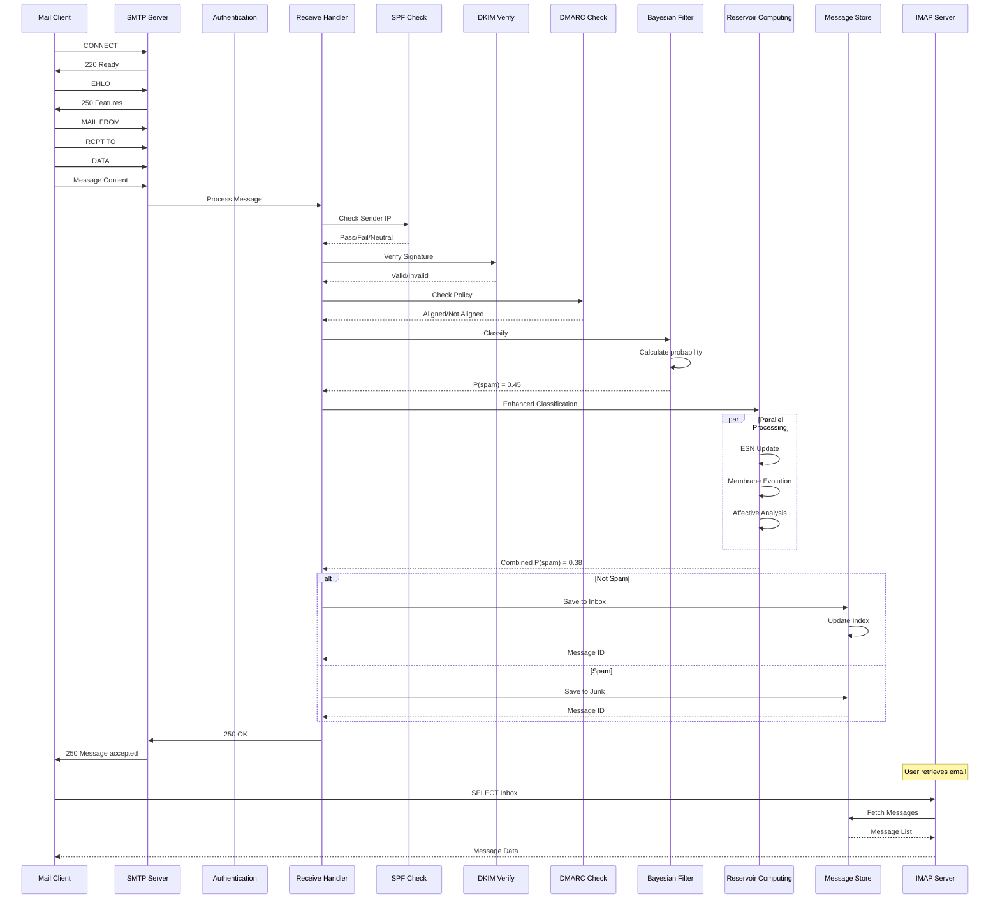
```mermaid
sequenceDiagram
    participant Client as Mail Client
    participant SMTP as SMTP Server
    participant Auth as Authentication
    participant Receive as Receive Handler
    participant SPF as SPF Check
    participant DKIM as DKIM Verify
    participant DMARC as DMARC Check
    participant Bayesian as Bayesian Filter
    participant Reservoir as Reservoir Computing
    participant Store as Message Store
    participant IMAP as IMAP Server

    Client->>SMTP: CONNECT
    SMTP->>Client: 220 Ready
    Client->>SMTP: EHLO
    SMTP->>Client: 250 Features
    Client->>SMTP: MAIL FROM
    Client->>SMTP: RCPT TO
    Client->>SMTP: DATA
    Client->>SMTP: Message Content
    
    SMTP->>Receive: Process Message
    
    Receive->>SPF: Check Sender IP
    SPF-->>Receive: Pass/Fail/Neutral
    
    Receive->>DKIM: Verify Signature
    DKIM-->>Receive: Valid/Invalid
    
    Receive->>DMARC: Check Policy
    DMARC-->>Receive: Aligned/Not Aligned
    
    Receive->>Bayesian: Classify
    Bayesian->>Bayesian: Calculate probability
    Bayesian-->>Receive: P(spam) = 0.45
    
    Receive->>Reservoir: Enhanced Classification
    
    par Parallel Processing
        Reservoir->>Reservoir: ESN Update
        Reservoir->>Reservoir: Membrane Evolution
        Reservoir->>Reservoir: Affective Analysis
    end
    
    Reservoir-->>Receive: Combined P(spam) = 0.38
    
    alt Not Spam
        Receive->>Store: Save to Inbox
        Store->>Store: Update Index
        Store-->>Receive: Message ID
    else Spam
        Receive->>Store: Save to Junk
        Store-->>Receive: Message ID
    end
    
    Receive->>SMTP: 250 OK
    SMTP->>Client: 250 Message accepted
    
    Note over IMAP: User retrieves email
    Client->>IMAP: SELECT Inbox
    IMAP->>Store: Fetch Messages
    Store-->>IMAP: Message List
    IMAP-->>Client: Message Data
```

### Outgoing Email Flow

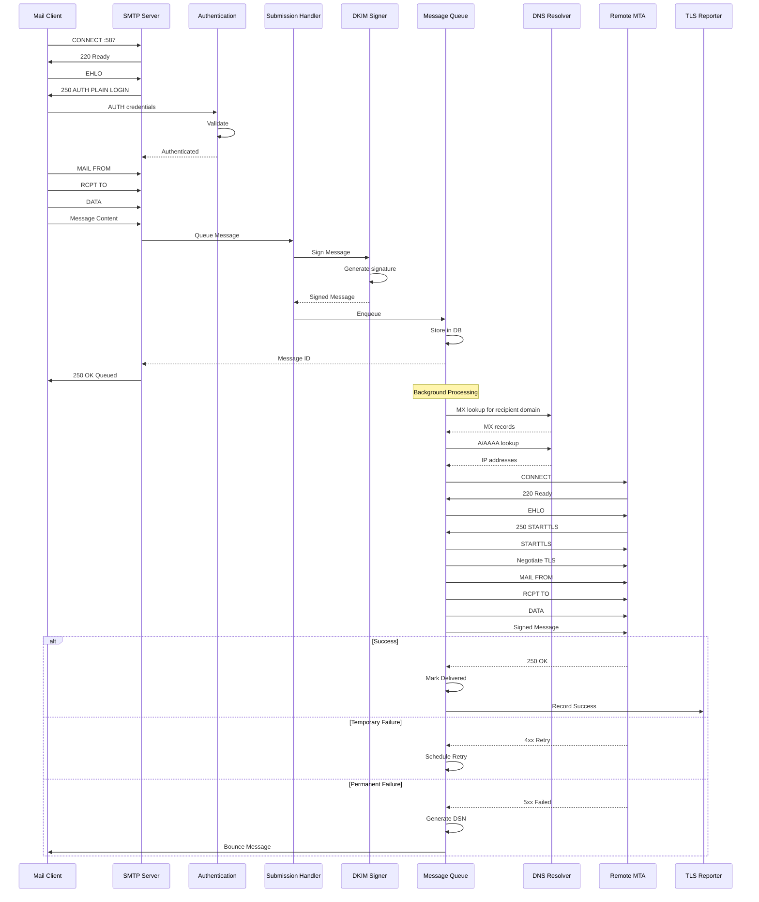
```mermaid
sequenceDiagram
    participant Client as Mail Client
    participant SMTP as SMTP Server
    participant Auth as Authentication
    participant Submit as Submission Handler
    participant DKIM as DKIM Signer
    participant Queue as Message Queue
    participant DNS as DNS Resolver
    participant Remote as Remote MTA
    participant TLSRPT as TLS Reporter

    Client->>SMTP: CONNECT :587
    SMTP->>Client: 220 Ready
    Client->>SMTP: EHLO
    SMTP->>Client: 250 AUTH PLAIN LOGIN
    
    Client->>Auth: AUTH credentials
    Auth->>Auth: Validate
    Auth-->>SMTP: Authenticated
    
    Client->>SMTP: MAIL FROM
    Client->>SMTP: RCPT TO
    Client->>SMTP: DATA
    Client->>SMTP: Message Content
    
    SMTP->>Submit: Queue Message
    Submit->>DKIM: Sign Message
    DKIM->>DKIM: Generate signature
    DKIM-->>Submit: Signed Message
    
    Submit->>Queue: Enqueue
    Queue->>Queue: Store in DB
    Queue-->>SMTP: Message ID
    SMTP->>Client: 250 OK Queued
    
    Note over Queue: Background Processing
    
    Queue->>DNS: MX lookup for recipient domain
    DNS-->>Queue: MX records
    
    Queue->>DNS: A/AAAA lookup
    DNS-->>Queue: IP addresses
    
    Queue->>Remote: CONNECT
    Remote->>Queue: 220 Ready
    
    Queue->>Remote: EHLO
    Remote->>Queue: 250 STARTTLS
    
    Queue->>Remote: STARTTLS
    Queue->>Remote: Negotiate TLS
    
    Queue->>Remote: MAIL FROM
    Queue->>Remote: RCPT TO
    Queue->>Remote: DATA
    Queue->>Remote: Signed Message
    
    alt Success
        Remote-->>Queue: 250 OK
        Queue->>Queue: Mark Delivered
        Queue->>TLSRPT: Record Success
    else Temporary Failure
        Remote-->>Queue: 4xx Retry
        Queue->>Queue: Schedule Retry
    else Permanent Failure
        Remote-->>Queue: 5xx Failed
        Queue->>Queue: Generate DSN
        Queue->>Client: Bounce Message
    end
```

### Spam Classification Pipeline

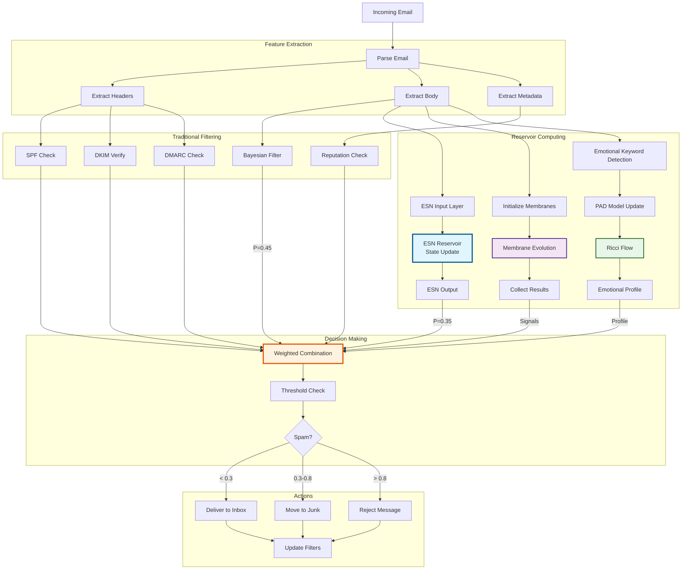
```mermaid
flowchart TB
    START[Incoming Email]
    
    subgraph "Feature Extraction"
        PARSE[Parse Email]
        HEADER[Extract Headers]
        BODY[Extract Body]
        META[Extract Metadata]
    end

    subgraph "Traditional Filtering"
        SPF[SPF Check]
        DKIM[DKIM Verify]
        DMARC[DMARC Check]
        BAYES[Bayesian Filter]
        REP[Reputation Check]
    end

    subgraph "Reservoir Computing"
        direction TB
        ESN_IN[ESN Input Layer]
        ESN_RES[ESN Reservoir<br/>State Update]
        ESN_OUT[ESN Output]
        
        MEM_INIT[Initialize Membranes]
        MEM_EV[Membrane Evolution]
        MEM_OUT[Collect Results]
        
        AFF_PARSE[Emotional Keyword Detection]
        AFF_PAD[PAD Model Update]
        AFF_RICCI[Ricci Flow]
        AFF_OUT[Emotional Profile]
    end

    subgraph "Decision Making"
        COMBINE[Weighted Combination]
        THRESHOLD[Threshold Check]
        DECIDE{Spam?}
    end

    subgraph "Actions"
        INBOX[Deliver to Inbox]
        JUNK[Move to Junk]
        REJECT[Reject Message]
        LEARN[Update Filters]
    end

    START --> PARSE
    PARSE --> HEADER
    PARSE --> BODY
    PARSE --> META

    HEADER --> SPF
    HEADER --> DKIM
    HEADER --> DMARC
    META --> REP
    
    BODY --> BAYES
    BAYES --> |P=0.45| COMBINE

    BODY --> ESN_IN
    ESN_IN --> ESN_RES
    ESN_RES --> ESN_OUT
    ESN_OUT --> |P=0.35| COMBINE

    BODY --> MEM_INIT
    MEM_INIT --> MEM_EV
    MEM_EV --> MEM_OUT
    MEM_OUT --> |Signals| COMBINE

    BODY --> AFF_PARSE
    AFF_PARSE --> AFF_PAD
    AFF_PAD --> AFF_RICCI
    AFF_RICCI --> AFF_OUT
    AFF_OUT --> |Profile| COMBINE

    SPF --> COMBINE
    DKIM --> COMBINE
    DMARC --> COMBINE
    REP --> COMBINE

    COMBINE --> THRESHOLD
    THRESHOLD --> DECIDE

    DECIDE -->|< 0.3| INBOX
    DECIDE -->|0.3-0.8| JUNK
    DECIDE -->|> 0.8| REJECT

    INBOX --> LEARN
    JUNK --> LEARN
    REJECT --> LEARN

    style ESN_RES fill:#e1f5ff,stroke:#01579b,stroke-width:3px
    style MEM_EV fill:#f3e5f5,stroke:#4a148c,stroke-width:2px
    style AFF_RICCI fill:#e8f5e9,stroke:#1b5e20,stroke-width:2px
    style COMBINE fill:#fff3e0,stroke:#e65100,stroke-width:3px
```

---

## Data Architecture

### Database Schema

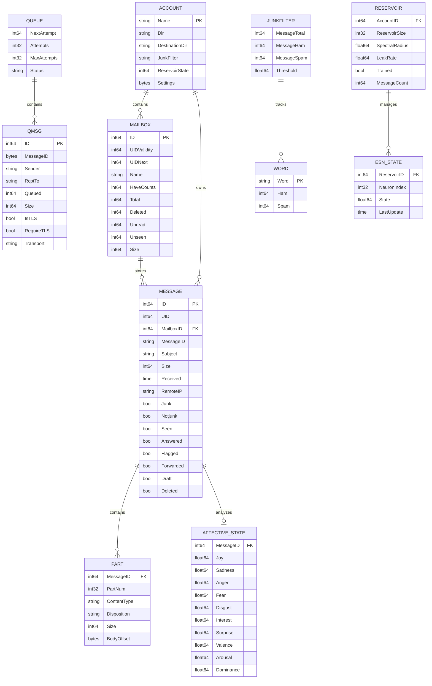
```mermaid
erDiagram
    ACCOUNT ||--o{ MAILBOX : contains
    ACCOUNT ||--o{ MESSAGE : owns
    ACCOUNT {
        string Name PK
        string Dir
        string DestinationDir
        string JunkFilter
        int64 ReservoirState
        bytes Settings
    }

    MAILBOX ||--o{ MESSAGE : stores
    MAILBOX {
        int64 ID PK
        int64 UIDValidity
        int64 UIDNext
        string Name
        int64 HaveCounts
        int64 Total
        int64 Deleted
        int64 Unread
        int64 Unseen
        int64 Size
    }

    MESSAGE ||--o{ PART : contains
    MESSAGE {
        int64 ID PK
        int64 UID
        int64 MailboxID FK
        string MessageID
        string Subject
        int64 Size
        time Received
        string RemoteIP
        bool Junk
        bool Notjunk
        bool Seen
        bool Answered
        bool Flagged
        bool Forwarded
        bool Draft
        bool Deleted
    }

    PART {
        int64 MessageID FK
        int32 PartNum
        string ContentType
        string Disposition
        int64 Size
        bytes BodyOffset
    }

    QUEUE ||--o{ QMSG : contains
    QUEUE {
        int64 NextAttempt
        int32 Attempts
        int32 MaxAttempts
        string Status
    }

    QMSG {
        int64 ID PK
        bytes MessageID
        string Sender
        string RcptTo
        int64 Queued
        int64 Size
        bool IsTLS
        bool RequireTLS
        string Transport
    }

    JUNKFILTER ||--o{ WORD : tracks
    JUNKFILTER {
        int64 MessageTotal
        int64 MessageHam
        int64 MessageSpam
        float64 Threshold
    }

    WORD {
        string Word PK
        int64 Ham
        int64 Spam
    }

    RESERVOIR ||--o{ ESN_STATE : manages
    RESERVOIR {
        int64 AccountID FK
        int32 ReservoirSize
        float64 SpectralRadius
        float64 LeakRate
        bool Trained
        int64 MessageCount
    }

    ESN_STATE {
        int64 ReservoirID FK
        int32 NeuronIndex
        float64 State
        time LastUpdate
    }

    AFFECTIVE_STATE {
        int64 MessageID FK
        float64 Joy
        float64 Sadness
        float64 Anger
        float64 Fear
        float64 Disgust
        float64 Interest
        float64 Surprise
        float64 Valence
        float64 Arousal
        float64 Dominance
    }

    MESSAGE ||--o| AFFECTIVE_STATE : analyzes
```

### File System Layout

```mermaid
graph TB
    subgraph "EchoMox Directory Structure"
        ROOT[/home/mox/]
        
        subgraph "Configuration"
            CONF[config/]
            MOX_CONF[mox.conf]
            DOM_CONF[domains.conf]
        end

        subgraph "Data Directory"
            DATA[data/]
            
            subgraph "Accounts"
                ACCTS[accounts/]
                USER1[user1@example.com/]
                INDEX1[index.db]
                MSG1[msg/]
                MSGDIR1[00001/]
                MSGFILE1[12345]
            end

            subgraph "Queue"
                QUEUE[queue/]
                QUEUEDB[index.db]
                QMSG[msg/]
            end

            subgraph "ACME"
                ACME[acme/]
                ACMEDB[keycerts/]
            end

            subgraph "Reservoir State"
                RESV[reservoir/]
                RSTATE[state.db]
                WEIGHTS[weights.dat]
            end
        end

        subgraph "Temporary"
            TMP[tmp/]
        end

        subgraph "Logs"
            LOGS[logs/]
        end
    end

    ROOT --> CONF
    ROOT --> DATA
    ROOT --> TMP
    ROOT --> LOGS

    CONF --> MOX_CONF
    CONF --> DOM_CONF

    DATA --> ACCTS
    DATA --> QUEUE
    DATA --> ACME
    DATA --> RESV

    ACCTS --> USER1
    USER1 --> INDEX1
    USER1 --> MSG1
    MSG1 --> MSGDIR1
    MSGDIR1 --> MSGFILE1

    QUEUE --> QUEUEDB
    QUEUE --> QMSG

    RESV --> RSTATE
    RESV --> WEIGHTS

    style RESV fill:#e1f5ff,stroke:#01579b,stroke-width:2px
    style RSTATE fill:#bbdefb,stroke:#1565c0
```

---

## Network Architecture

### Port and Protocol Layout

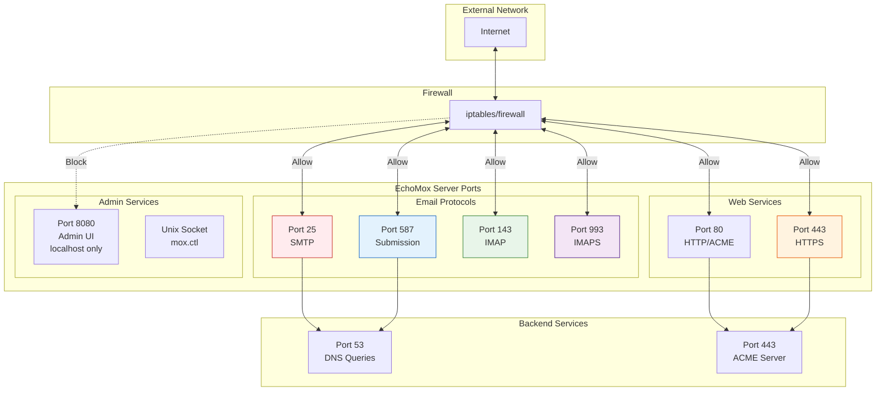
```mermaid
graph TB
    subgraph "External Network"
        INTERNET[Internet]
    end

    subgraph "Firewall"
        FW[iptables/firewall]
    end

    subgraph "EchoMox Server Ports"
        subgraph "Email Protocols"
            SMTP25[Port 25<br/>SMTP]
            SMTP587[Port 587<br/>Submission]
            IMAP143[Port 143<br/>IMAP]
            IMAPS993[Port 993<br/>IMAPS]
        end

        subgraph "Web Services"
            HTTP80[Port 80<br/>HTTP/ACME]
            HTTPS443[Port 443<br/>HTTPS]
        end

        subgraph "Admin Services"
        ADMIN[Port 8080<br/>Admin UI<br/>localhost only]
        CTL[Unix Socket<br/>mox.ctl]
        end
    end

    subgraph "Backend Services"
        DNS53[Port 53<br/>DNS Queries]
        ACME_SRV[Port 443<br/>ACME Server]
    end

    INTERNET <--> FW
    
    FW <-->|Allow| SMTP25
    FW <-->|Allow| SMTP587
    FW <-->|Allow| IMAP143
    FW <-->|Allow| IMAPS993
    FW <-->|Allow| HTTP80
    FW <-->|Allow| HTTPS443
    FW -.->|Block| ADMIN

    SMTP25 --> DNS53
    SMTP587 --> DNS53
    HTTP80 --> ACME_SRV
    HTTPS443 --> ACME_SRV

    style SMTP25 fill:#ffebee,stroke:#c62828
    style SMTP587 fill:#e3f2fd,stroke:#1565c0
    style IMAP143 fill:#e8f5e9,stroke:#2e7d32
    style IMAPS993 fill:#f3e5f5,stroke:#4a148c
    style HTTPS443 fill:#fff3e0,stroke:#e65100
```

### TLS/Security Flow

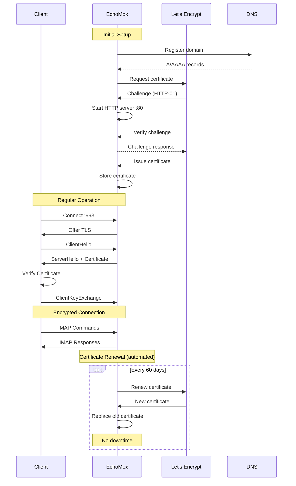
```mermaid
sequenceDiagram
    participant Client
    participant Server as EchoMox
    participant ACME as Let's Encrypt
    participant DNS

    Note over Server: Initial Setup
    Server->>DNS: Register domain
    DNS-->>Server: A/AAAA records

    Server->>ACME: Request certificate
    ACME->>Server: Challenge (HTTP-01)
    Server->>Server: Start HTTP server :80
    ACME->>Server: Verify challenge
    Server-->>ACME: Challenge response
    ACME->>Server: Issue certificate
    Server->>Server: Store certificate

    Note over Client,Server: Regular Operation

    Client->>Server: Connect :993
    Server->>Client: Offer TLS
    Client->>Server: ClientHello
    Server->>Client: ServerHello + Certificate
    Client->>Client: Verify Certificate
    Client->>Server: ClientKeyExchange
    
    Note over Client,Server: Encrypted Connection
    
    Client->>Server: IMAP Commands
    Server->>Client: IMAP Responses

    Note over Server: Certificate Renewal (automated)
    
    loop Every 60 days
        Server->>ACME: Renew certificate
        ACME->>Server: New certificate
        Server->>Server: Replace old certificate
        Note over Server: No downtime
    end
```

---

## Security Architecture

### Authentication Flow

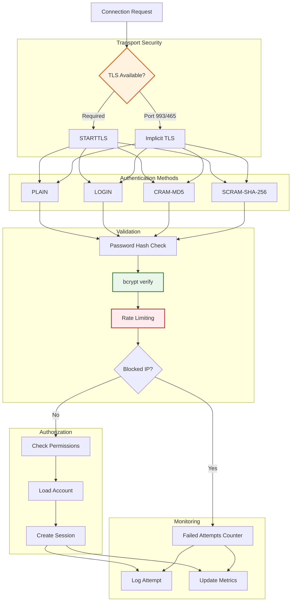
```mermaid
flowchart TB
    START[Connection Request]
    
    subgraph "Transport Security"
        TLS{TLS Available?}
        STARTTLS[STARTTLS]
        IMPLICIT[Implicit TLS]
    end

    subgraph "Authentication Methods"
        PLAIN[PLAIN]
        LOGIN[LOGIN]
        CRAM[CRAM-MD5]
        SCRAM[SCRAM-SHA-256]
    end

    subgraph "Validation"
        HASH[Password Hash Check]
        BCRYPT[bcrypt verify]
        RATE[Rate Limiting]
        BLOCK{Blocked IP?}
    end

    subgraph "Authorization"
        PERMS[Check Permissions]
        ACCOUNT[Load Account]
        SESSION[Create Session]
    end

    subgraph "Monitoring"
        LOG[Log Attempt]
        METRICS[Update Metrics]
        FAIL[Failed Attempts Counter]
    end

    START --> TLS
    TLS -->|Required| STARTTLS
    TLS -->|Port 993/465| IMPLICIT
    
    STARTTLS --> PLAIN
    STARTTLS --> LOGIN
    STARTTLS --> CRAM
    STARTTLS --> SCRAM
    IMPLICIT --> PLAIN
    IMPLICIT --> LOGIN
    IMPLICIT --> CRAM
    IMPLICIT --> SCRAM

    PLAIN --> HASH
    LOGIN --> HASH
    CRAM --> HASH
    SCRAM --> HASH

    HASH --> BCRYPT
    BCRYPT --> RATE
    RATE --> BLOCK

    BLOCK -->|No| PERMS
    BLOCK -->|Yes| FAIL

    PERMS --> ACCOUNT
    ACCOUNT --> SESSION
    SESSION --> LOG
    SESSION --> METRICS

    FAIL --> LOG
    FAIL --> METRICS

    style TLS fill:#fff3e0,stroke:#e65100,stroke-width:2px
    style BCRYPT fill:#e8f5e9,stroke:#2e7d32,stroke-width:2px
    style RATE fill:#ffebee,stroke:#c62828,stroke-width:2px
```

### SPF/DKIM/DMARC Validation

```mermaid
sequenceDiagram
    participant Sender as Remote MTA
    participant EchoMox
    participant DNS
    participant Filters as Spam Filters

    Sender->>EchoMox: MAIL FROM: sender@example.com
    Sender->>EchoMox: Message with DKIM signature

    Note over EchoMox: SPF Check
    EchoMox->>DNS: TXT example.com (SPF record)
    DNS-->>EchoMox: "v=spf1 ip4:1.2.3.4 ~all"
    EchoMox->>EchoMox: Compare sender IP
    
    alt SPF Pass
        EchoMox->>EchoMox: SPF: Pass
    else SPF Fail
        EchoMox->>EchoMox: SPF: Fail (lower score)
    end

    Note over EchoMox: DKIM Verification
    EchoMox->>EchoMox: Extract DKIM signature
    EchoMox->>DNS: TXT selector._domainkey.example.com
    DNS-->>EchoMox: Public key
    EchoMox->>EchoMox: Verify signature
    
    alt DKIM Valid
        EchoMox->>EchoMox: DKIM: Pass
    else DKIM Invalid
        EchoMox->>EchoMox: DKIM: Fail (lower score)
    end

    Note over EchoMox: DMARC Check
    EchoMox->>DNS: TXT _dmarc.example.com
    DNS-->>EchoMox: "v=DMARC1; p=quarantine; rua=mailto:..."
    EchoMox->>EchoMox: Check SPF/DKIM alignment
    
    alt DMARC Pass
        EchoMox->>EchoMox: DMARC: Pass
        EchoMox->>Filters: Authenticated message
    else DMARC Fail
        EchoMox->>EchoMox: DMARC: Fail
        EchoMox->>Filters: Apply policy (quarantine/reject)
        EchoMox->>DNS: Send aggregate report
    end

    Filters->>Filters: Additional filtering
    Filters-->>EchoMox: Final decision
```

---

## Deployment Architecture

### Single Server Deployment

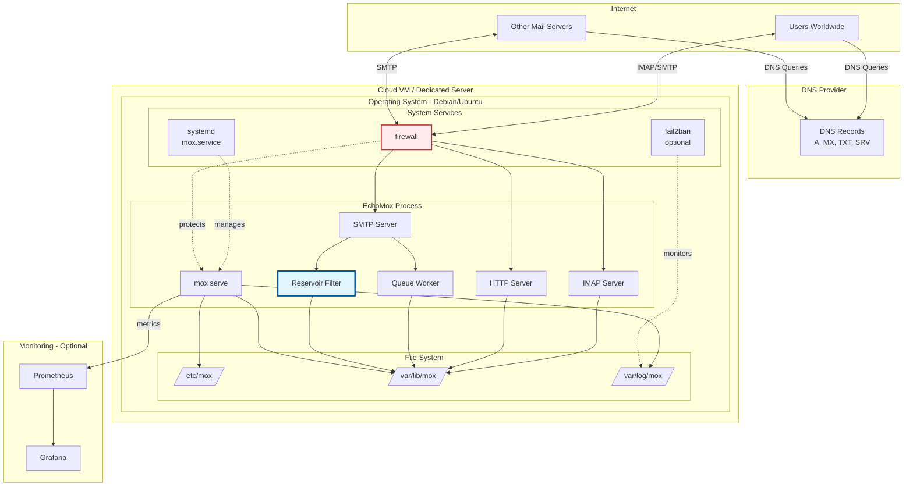
```mermaid
graph TB
    subgraph "Internet"
        USERS[Users Worldwide]
        MTA[Other Mail Servers]
    end

    subgraph "DNS Provider"
        DNS[DNS Records<br/>A, MX, TXT, SRV]
    end

    subgraph "Cloud VM / Dedicated Server"
        subgraph "Operating System - Debian/Ubuntu"
            subgraph "EchoMox Process"
                MAIN[mox serve]
                SMTP_S[SMTP Server]
                IMAP_S[IMAP Server]
                HTTP_S[HTTP Server]
                QUEUE_S[Queue Worker]
                RESV_S[Reservoir Filter]
            end

            subgraph "File System"
                CONFIG[/etc/mox/]
                DATA[/var/lib/mox/]
                LOGS[/var/log/mox/]
            end

            subgraph "System Services"
                SYSTEMD[systemd<br/>mox.service]
                FIREWALL[firewall]
                FAIL2BAN[fail2ban<br/>optional]
            end
        end
    end

    subgraph "Monitoring - Optional"
        PROM[Prometheus]
        GRAF[Grafana]
    end

    USERS <-->|IMAP/SMTP| FIREWALL
    MTA <-->|SMTP| FIREWALL
    USERS -->|DNS Queries| DNS
    MTA -->|DNS Queries| DNS

    FIREWALL --> SMTP_S
    FIREWALL --> IMAP_S
    FIREWALL --> HTTP_S

    SMTP_S --> RESV_S
    SMTP_S --> QUEUE_S
    IMAP_S --> DATA
    HTTP_S --> DATA
    QUEUE_S --> DATA

    RESV_S --> DATA

    MAIN --> CONFIG
    MAIN --> DATA
    MAIN --> LOGS

    SYSTEMD -.->|manages| MAIN
    FIREWALL -.->|protects| MAIN
    FAIL2BAN -.->|monitors| LOGS

    MAIN -->|metrics| PROM
    PROM --> GRAF

    style RESV_S fill:#e1f5ff,stroke:#01579b,stroke-width:3px
    style FIREWALL fill:#ffebee,stroke:#c62828,stroke-width:2px
```

### High-Availability Deployment (Future)

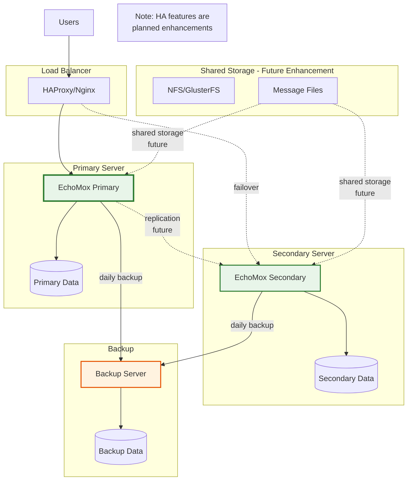
```mermaid
graph TB
    subgraph "Load Balancer"
        LB[HAProxy/Nginx]
    end

    subgraph "Primary Server"
        PRIMARY[EchoMox Primary]
        PDATA[(Primary Data)]
    end

    subgraph "Secondary Server"
        SECONDARY[EchoMox Secondary]
        SDATA[(Secondary Data)]
    end

    subgraph "Shared Storage - Future Enhancement"
        NFS[NFS/GlusterFS]
        MSGS[Message Files]
    end

    subgraph "Backup"
        BACKUP[Backup Server]
        BDATA[(Backup Data)]
    end

    USERS[Users] --> LB
    LB --> PRIMARY
    LB -.->|failover| SECONDARY

    PRIMARY --> PDATA
    SECONDARY --> SDATA

    PRIMARY -.->|replication<br/>future| SECONDARY
    MSGS -.->|shared storage<br/>future| PRIMARY
    MSGS -.->|shared storage<br/>future| SECONDARY

    PRIMARY -->|daily backup| BACKUP
    SECONDARY -->|daily backup| BACKUP
    BACKUP --> BDATA

    style PRIMARY fill:#e8f5e9,stroke:#2e7d32,stroke-width:3px
    style SECONDARY fill:#e8f5e9,stroke:#2e7d32,stroke-width:2px
    style BACKUP fill:#fff3e0,stroke:#e65100,stroke-width:2px

    note1[Note: HA features are<br/>planned enhancements]
```

### Docker Deployment

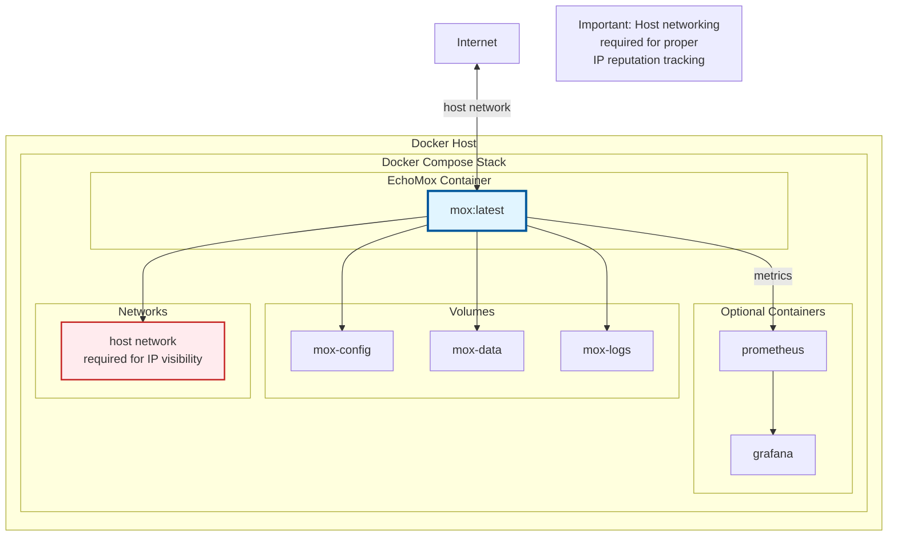
```mermaid
graph TB
    subgraph "Docker Host"
        subgraph "Docker Compose Stack"
            subgraph "EchoMox Container"
                MOX[mox:latest]
            end

            subgraph "Optional Containers"
                PROM[prometheus]
                GRAF[grafana]
            end

            subgraph "Volumes"
                VCONF[mox-config]
                VDATA[mox-data]
                VLOGS[mox-logs]
            end

            subgraph "Networks"
                NET[host network<br/>required for IP visibility]
            end
        end
    end

    MOX --> VCONF
    MOX --> VDATA
    MOX --> VLOGS
    MOX --> NET

    MOX -->|metrics| PROM
    PROM --> GRAF

    INTERNET[Internet] <-->|host network| MOX

    style MOX fill:#e1f5ff,stroke:#01579b,stroke-width:3px
    style NET fill:#ffebee,stroke:#c62828,stroke-width:2px

    note1[Important: Host networking<br/>required for proper<br/>IP reputation tracking]
```

---

## Performance Characteristics

### System Capacity

| Metric | Single Core | 4 Cores | Notes |
|--------|-------------|---------|-------|
| SMTP Connections/sec | 100 | 400 | New connections |
| IMAP Connections/sec | 200 | 800 | New connections |
| Email Classification/sec | 1,000 | 4,000 | With Bayesian only |
| Email Classification/sec | 800 | 3,200 | With Reservoir Computing |
| Concurrent IMAP Clients | 500 | 2,000 | Idle connections |
| Queue Throughput | 50/sec | 200/sec | Outgoing delivery |

### Memory Usage

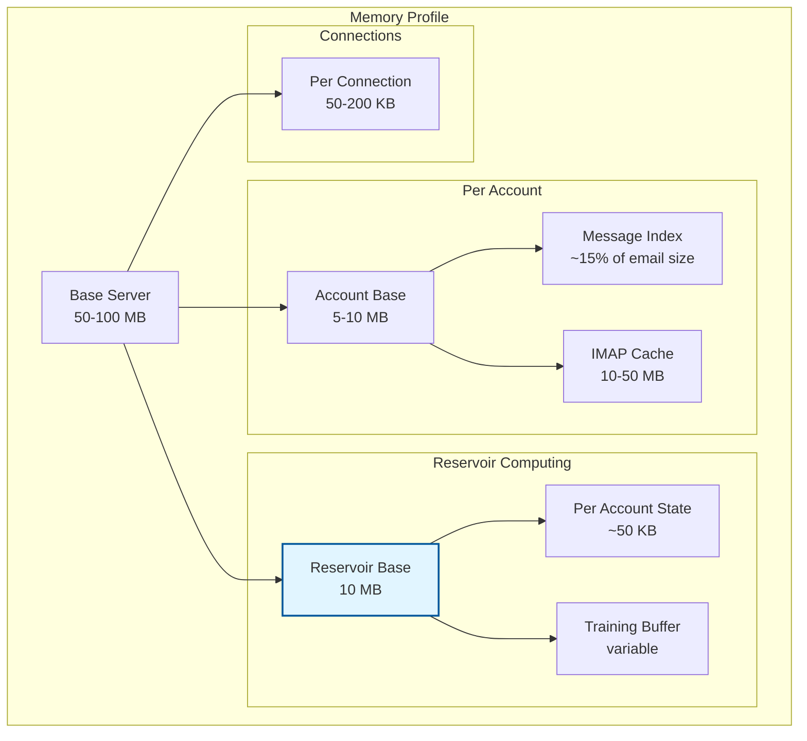
```mermaid
graph TB
    subgraph "Memory Profile"
        BASE[Base Server<br/>50-100 MB]
        
        subgraph "Per Account"
            ACC_BASE[Account Base<br/>5-10 MB]
            ACC_INDEX[Message Index<br/>~15% of email size]
            ACC_CACHE[IMAP Cache<br/>10-50 MB]
        end

        subgraph "Reservoir Computing"
            RESV_BASE[Reservoir Base<br/>10 MB]
            RESV_PER[Per Account State<br/>~50 KB]
            RESV_TRAIN[Training Buffer<br/>variable]
        end

        subgraph "Connections"
            CONN[Per Connection<br/>50-200 KB]
        end
    end

    BASE --> ACC_BASE
    ACC_BASE --> ACC_INDEX
    ACC_BASE --> ACC_CACHE
    
    BASE --> RESV_BASE
    RESV_BASE --> RESV_PER
    RESV_BASE --> RESV_TRAIN

    BASE --> CONN

    style RESV_BASE fill:#e1f5ff,stroke:#01579b,stroke-width:2px
```

### Performance Optimization Tips

1. **Reservoir Computing**: Start with `ReservoirSize=50` for small deployments
2. **IMAP Idle**: Limit concurrent IDLE connections via config
3. **Message Index**: Regular database maintenance with `mox verifydata`
4. **Queue**: Adjust retry intervals based on your email volume
5. **TLS**: Use ECDSA certificates for faster handshakes

---

## Conclusion

EchoMox represents a sophisticated integration of traditional mail server technology with cutting-edge reservoir computing techniques. The architecture is designed to be:

- **Modular**: Clear separation of concerns between components
- **Scalable**: Handles growing email volumes efficiently
- **Secure**: Multiple layers of security and authentication
- **Maintainable**: Clean code structure with comprehensive documentation
- **Extensible**: Easy to add new features and integrations

For more detailed information:
- See [RESERVOIR_COMPUTING.md](../RESERVOIR_COMPUTING.md) for AI/ML details
- See [README.md](../README.md) for quick start guide
- See [reservoir/README.md](../reservoir/README.md) for package documentation
- Visit [https://github.com/Entelecho/echomox](https://github.com/Entelecho/echomox) for source code

---

**Document Version**: 1.0  
**Last Updated**: 2025-10-23  
**Maintainers**: EchoMox Development Team
