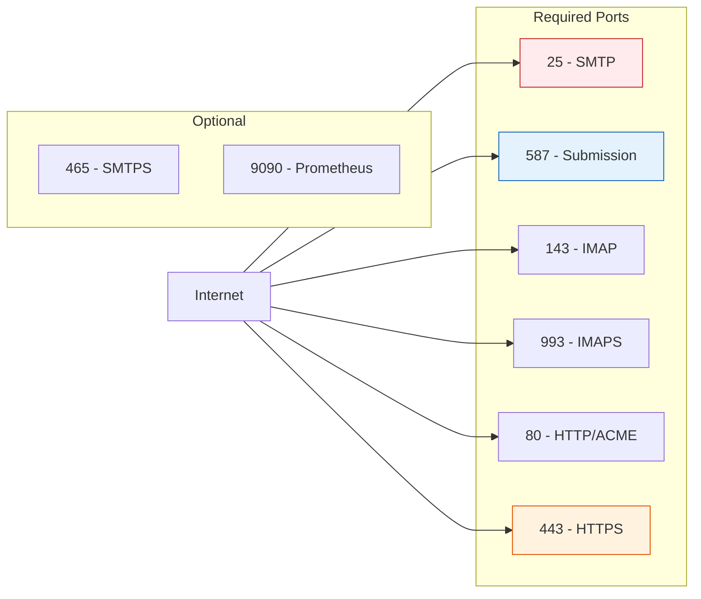
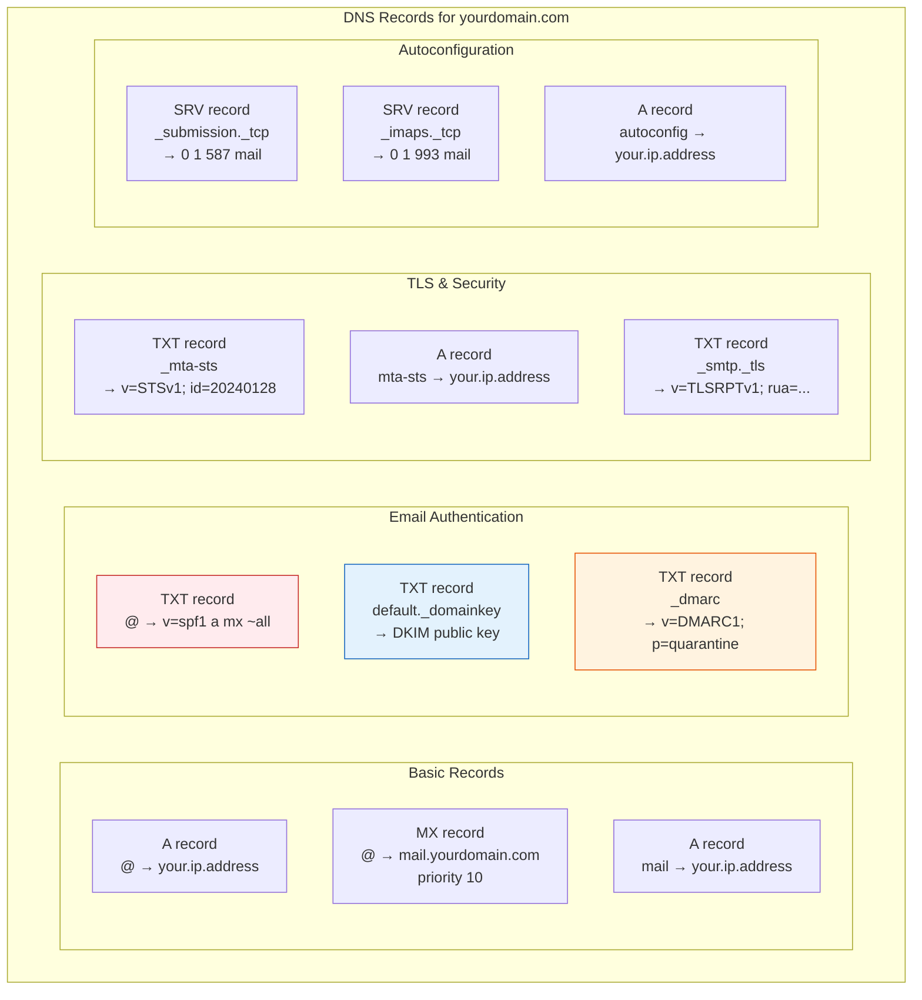
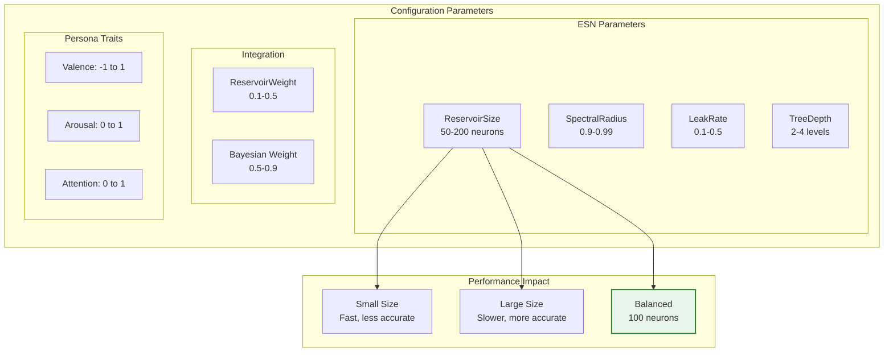
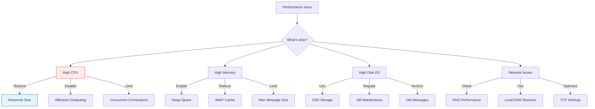

# EchoMox Deployment Guide

## Table of Contents

1. [Prerequisites](#prerequisites)
2. [Quick Start](#quick-start)
3. [Installation Methods](#installation-methods)
4. [Configuration](#configuration)
5. [DNS Setup](#dns-setup)
6. [Reservoir Computing Configuration](#reservoir-computing-configuration)
7. [Monitoring and Maintenance](#monitoring-and-maintenance)
8. [Troubleshooting](#troubleshooting)

---

## Prerequisites

### System Requirements

#### Minimum Requirements
- **CPU**: 1 core (2+ cores recommended)
- **RAM**: 512 MB (1 GB+ recommended)
- **Storage**: 10 GB (more based on email volume)
- **OS**: Linux (Debian, Ubuntu, RHEL, etc.) or BSD
- **Network**: Static public IP address
- **Domain**: Registered domain with DNS control

#### Recommended Configuration
- **CPU**: 2-4 cores
- **RAM**: 2-4 GB
- **Storage**: 50-100 GB SSD
- **OS**: Ubuntu 22.04 LTS or Debian 12
- **Network**: Gigabit connection

### Network Requirements



---

## Quick Start

### Option 1: Binary Installation (Recommended)

```bash
# Create mox user
sudo useradd -m -d /home/mox mox

# Switch to mox user
sudo -u mox -i

# Download latest echomox binary
cd /home/mox
GOBIN=$PWD CGO_ENABLED=0 go install github.com/mjl-/mox@latest
mv mox echomox  # or create symlink

# Run quickstart
./echomox quickstart you@yourdomain.com

# Follow the instructions to:
# 1. Add DNS records
# 2. Start the server
# 3. Access admin interface
```

### Option 2: Docker Deployment

```bash
# Create docker-compose.yml
cat > docker-compose.yml << 'EOF'
version: '3.8'

services:
  echomox:
    image: r.xmox.nl/mox:latest
    container_name: echomox
    network_mode: host  # Required for IP reputation
    volumes:
      - ./config:/etc/mox
      - ./data:/var/lib/mox
      - ./logs:/var/log/mox
    restart: unless-stopped
    environment:
      - TZ=UTC

  # Optional: Prometheus for monitoring
  prometheus:
    image: prom/prometheus:latest
    container_name: prometheus
    ports:
      - "9090:9090"
    volumes:
      - ./prometheus.yml:/etc/prometheus/prometheus.yml
      - prometheus-data:/prometheus
    restart: unless-stopped

  # Optional: Grafana for visualization
  grafana:
    image: grafana/grafana:latest
    container_name: grafana
    ports:
      - "3000:3000"
    volumes:
      - grafana-data:/var/lib/grafana
    restart: unless-stopped
    environment:
      - GF_SECURITY_ADMIN_PASSWORD=changeme

volumes:
  prometheus-data:
  grafana-data:
EOF

# Initialize configuration
mkdir -p config data logs
docker-compose run --rm echomox quickstart you@yourdomain.com

# Start services
docker-compose up -d
```

### Option 3: Compile from Source

```bash
# Install Go 1.23+
wget https://go.dev/dl/go1.23.0.linux-amd64.tar.gz
sudo tar -C /usr/local -xzf go1.23.0.linux-amd64.tar.gz
export PATH=$PATH:/usr/local/go/bin

# Clone repository
git clone https://github.com/Entelecho/echomox.git
cd echomox

# Build
make build

# The binary will be in the current directory
./mox quickstart you@yourdomain.com
```

---

## Installation Methods

### Systemd Service Installation

After running quickstart, install as a systemd service:

```bash
# Generate service file
./echomox config printservice | sudo tee /etc/systemd/system/mox.service

# Enable and start service
sudo systemctl daemon-reload
sudo systemctl enable mox
sudo systemctl start mox

# Check status
sudo systemctl status mox
```

### Directory Structure

```
/home/mox/
├── echomox                 # Binary
├── config/
│   ├── mox.conf           # Main configuration
│   └── domains.conf       # Domain/account configuration
├── data/
│   ├── accounts/          # User mailboxes
│   │   └── user@domain/
│   │       ├── index.db   # Message index
│   │       └── msg/       # Message files
│   ├── queue/             # Outgoing queue
│   │   ├── index.db
│   │   └── msg/
│   ├── acme/              # TLS certificates
│   └── reservoir/         # ML model state
│       ├── state.db
│       └── weights.dat
└── logs/
    └── mox.log
```

---

## Configuration

### Basic Configuration (mox.conf)

```yaml
# /home/mox/config/mox.conf
DataDir: /home/mox/data
LogLevel: info
Hostname: mail.yourdomain.com

# Listeners for incoming connections
Listeners:
  public:
    IPs:
      - 0.0.0.0
      - '::'
    
    # SMTP (port 25)
    SMTP:
      Enabled: true
    
    # Submission (port 587)
    Submission:
      Enabled: true
      RequireSTARTTLS: true
    
    # IMAP (port 143/993)
    IMAP:
      Enabled: true
    
    # HTTPS (port 443)
    HTTPS:
      Enabled: true
      Port: 443
    
    # TLS with ACME
    TLS:
      ACME: letsencrypt

# ACME configuration
ACME:
  letsencrypt:
    DirectoryURL: https://acme-v02.api.letsencrypt.org/directory
    ContactEmail: admin@yourdomain.com

# Web interfaces
WebserverHTTP:
  Port: 80
  
# Admin interface (localhost only for security)
AdminPasswordFile: /home/mox/data/adminpasswd
```

### Domain Configuration (domains.conf)

```yaml
# /home/mox/config/domains.conf
Domains:
  yourdomain.com:
    LocalpartCatchallSeparator: +
    LocalpartCaseSensitive: false
    
    # DKIM signing
    DKIM:
      Selectors:
        default:
          Hash: sha256
          Expiration: 72h
    
    # SPF record info
    # Add to DNS: v=spf1 a mx ~all
    
    # DMARC record info  
    # Add to DNS: v=DMARC1; p=quarantine; rua=mailto:dmarc@yourdomain.com
    
    # MTA-STS
    MTASTS:
      PolicyID: 2024012801
      Mode: enforce
      MaxAge: 86400

Accounts:
  user:
    Domain: yourdomain.com
    Destinations:
      user@yourdomain.com: null
      postmaster@yourdomain.com: null
    
    # Junk filtering
    JunkFilter:
      Threshold: 0.95
      Params:
        Onegrams: true
        Twograms: true
        Threegrams: true
    
    # Reservoir computing configuration
    ReservoirFilter:
      Enabled: true
      ReservoirWeight: 0.3
      ESNParams:
        ReservoirSize: 100
        SpectralRadius: 0.95
        LeakRate: 0.3
        TreeDepth: 3
      Persona:
        Valence: 0.2
        Arousal: 0.6
        Dominance: 0.5
        Attention: 0.8
        Memory: 0.7
        Creativity: 0.5
```

---

## DNS Setup

### Required DNS Records



### DNS Configuration Example

```bash
# Get DNS records from echomox
./echomox config dnsrecords yourdomain.com

# Example output:
@ 300 IN MX 10 mail.yourdomain.com.
@ 300 IN TXT "v=spf1 a mx ~all"
@ 300 IN TXT "v=DMARC1; p=quarantine; rua=mailto:dmarc@yourdomain.com"

mail 300 IN A 203.0.113.42
mail 300 IN AAAA 2001:db8::42

default._domainkey 300 IN TXT "v=DKIM1; k=ed25519; p=ABC123..."

_mta-sts 300 IN TXT "v=STSv1; id=2024012801"
mta-sts 300 IN A 203.0.113.42

_smtp._tls 300 IN TXT "v=TLSRPTv1; rua=mailto:tlsrpt@yourdomain.com"

_submission._tcp 300 IN SRV 0 1 587 mail.yourdomain.com.
_imaps._tcp 300 IN SRV 0 1 993 mail.yourdomain.com.

autoconfig 300 IN A 203.0.113.42
```

### Verification

```bash
# Check MX records
dig +short MX yourdomain.com

# Check SPF
dig +short TXT yourdomain.com | grep spf

# Check DKIM
dig +short TXT default._domainkey.yourdomain.com

# Check DMARC
dig +short TXT _dmarc.yourdomain.com

# Use echomox built-in checker
./echomox config dnscheck yourdomain.com
```

---

## Reservoir Computing Configuration

### Understanding Reservoir Parameters



### Configuration Presets

#### Conservative (Default)
Best for production, proven accuracy:

```yaml
ReservoirFilter:
  Enabled: true
  ReservoirWeight: 0.2  # 20% reservoir, 80% Bayesian
  ESNParams:
    ReservoirSize: 50
    SpectralRadius: 0.95
    LeakRate: 0.3
    TreeDepth: 2
```

#### Balanced
Good mix of accuracy and ML features:

```yaml
ReservoirFilter:
  Enabled: true
  ReservoirWeight: 0.3  # 30% reservoir, 70% Bayesian
  ESNParams:
    ReservoirSize: 100
    SpectralRadius: 0.95
    LeakRate: 0.3
    TreeDepth: 3
```

#### Aggressive
Maximum ML features, requires more CPU:

```yaml
ReservoirFilter:
  Enabled: true
  ReservoirWeight: 0.4  # 40% reservoir, 60% Bayesian
  ESNParams:
    ReservoirSize: 200
    SpectralRadius: 0.97
    LeakRate: 0.2
    TreeDepth: 4
```

### Tuning Persona Traits

Adjust based on your email patterns:

```yaml
Persona:
  # Positive for personal email, negative for transactional
  Valence: 0.2
  
  # Higher for high-volume, lower for low-volume
  Arousal: 0.6
  
  # Higher for confident filtering
  Dominance: 0.5
  
  # Higher for better detection, more CPU
  Attention: 0.8
  
  # Higher for long-term pattern learning
  Memory: 0.7
  
  # Higher for novel spam detection
  Creativity: 0.5
```

---

## Monitoring and Maintenance

### Logging

```bash
# View logs
tail -f /home/mox/data/mox.log

# Filter for errors
grep -i error /home/mox/data/mox.log

# Check reservoir computing activity
grep "reservoir" /home/mox/data/mox.log

# Check authentication failures
grep "authentication failed" /home/mox/data/mox.log
```

### Prometheus Metrics

```yaml
# prometheus.yml
global:
  scrape_interval: 15s

scrape_configs:
  - job_name: 'echomox'
    static_configs:
      - targets: ['localhost:8010']
```

Key metrics to monitor:
- `mox_smtpserver_incoming_total` - Incoming SMTP connections
- `mox_junkfilter_classify_total` - Messages classified
- `mox_reservoir_classify_total` - Reservoir classifications
- `mox_queue_size` - Outgoing queue size
- `mox_authentication_failures_total` - Failed auth attempts

### Backup

```bash
# Create backup
./echomox backup /backup/echomox-$(date +%Y%m%d)

# Verify backup
./echomox verifydata /backup/echomox-20240128/data

# Restore from backup
# 1. Stop echomox
sudo systemctl stop mox

# 2. Restore files
rm -rf /home/mox/data
cp -a /backup/echomox-20240128/data /home/mox/data

# 3. Verify
./echomox verifydata /home/mox/data

# 4. Start echomox
sudo systemctl start mox
```

### Updates

```bash
# Check for updates
./echomox checkupdate

# Download new version
GOBIN=/home/mox CGO_ENABLED=0 go install github.com/mjl-/mox@latest

# Create backup before upgrade
./echomox backup /backup/pre-upgrade-$(date +%Y%m%d)

# Stop service
sudo systemctl stop mox

# Replace binary
mv mox mox.old
mv ~/go/bin/mox .

# Verify data with new binary
./echomox verifydata /home/mox/data

# Start service
sudo systemctl start mox

# Check logs
sudo journalctl -u mox -f
```

---

## Troubleshooting

### Common Issues

#### 1. Emails Being Marked as Spam

**Symptoms**: Legitimate emails going to junk folder

**Solutions**:
```bash
# Check DKIM/SPF/DMARC
./echomox config dnscheck yourdomain.com

# Verify DNS propagation
dig +short TXT yourdomain.com
dig +short TXT default._domainkey.yourdomain.com

# Lower reservoir weight temporarily
# Edit domains.conf:
ReservoirWeight: 0.1  # Reduce from 0.3

# Train the filter
# Mark emails as "Not Junk" in webmail
```

#### 2. High CPU Usage

**Symptoms**: Server running slow, high load average

**Solutions**:
```bash
# Check reservoir configuration
# Reduce ReservoirSize in domains.conf:
ReservoirSize: 50  # Reduce from 100

# Disable affective computing temporarily:
EnableAffective: false

# Monitor specific process
top -p $(pgrep mox)

# Check for spam attacks
tail -f /home/mox/data/mox.log | grep "spam"
```

#### 3. TLS Certificate Issues

**Symptoms**: ACME challenges failing

**Solutions**:
```bash
# Check port 80 is accessible
sudo netstat -tlnp | grep :80

# Check firewall
sudo ufw status
sudo iptables -L -n

# Manual certificate check
curl http://yourdomain.com/.well-known/acme-challenge/test

# Check ACME logs
grep "acme" /home/mox/data/mox.log
```

#### 4. Queue Not Delivering

**Symptoms**: Messages stuck in queue

**Solutions**:
```bash
# Check queue
./echomox queue list

# Check specific message
./echomox queue dump MESSAGE_ID

# Force delivery attempt
./echomox queue schedule -now all

# Check DNS resolution
dig +short MX recipient-domain.com

# Check outbound connectivity
telnet gmail-smtp-in.l.google.com 25
```

#### 5. Reservoir Computing Not Working

**Symptoms**: No reservoir classifications in logs

**Solutions**:
```bash
# Check configuration
grep -A 10 "ReservoirFilter" /home/mox/config/domains.conf

# Verify enabled
Enabled: true  # Must be true

# Check logs for errors
grep "reservoir" /home/mox/data/mox.log | grep -i error

# Reset reservoir state
rm /home/mox/data/reservoir/state.db

# Restart service
sudo systemctl restart mox
```

### Performance Tuning



### Diagnostic Commands

```bash
# System status
./echomox admin systemstatus

# Check accounts
./echomox config account list

# Test email delivery
echo "Test message" | ./echomox sendmail you@yourdomain.com

# Check queue status
./echomox queue list

# Test DNS configuration
./echomox config dnscheck yourdomain.com

# Verify data integrity
./echomox verifydata /home/mox/data

# Check logs for specific issue
./echomox admin logreader -level error -last 1h
```

---

## Security Best Practices

### Firewall Configuration

```bash
# UFW (Ubuntu/Debian)
sudo ufw allow 25/tcp    # SMTP
sudo ufw allow 587/tcp   # Submission
sudo ufw allow 993/tcp   # IMAPS
sudo ufw allow 443/tcp   # HTTPS
sudo ufw allow 80/tcp    # HTTP (ACME)
sudo ufw enable

# iptables
sudo iptables -A INPUT -p tcp --dport 25 -j ACCEPT
sudo iptables -A INPUT -p tcp --dport 587 -j ACCEPT
sudo iptables -A INPUT -p tcp --dport 993 -j ACCEPT
sudo iptables -A INPUT -p tcp --dport 443 -j ACCEPT
sudo iptables -A INPUT -p tcp --dport 80 -j ACCEPT
```

### Fail2ban Integration (Optional)

```bash
# Install fail2ban
sudo apt-get install fail2ban

# Create filter
sudo tee /etc/fail2ban/filter.d/echomox.conf << 'EOF'
[Definition]
failregex = .*failed authentication attempt.*remote=<HOST>
ignoreregex =
EOF

# Create jail
sudo tee /etc/fail2ban/jail.d/echomox.conf << 'EOF'
[echomox]
enabled = true
port = smtp,submission,imap,imaps
filter = echomox
logpath = /home/mox/data/mox.log
maxretry = 5
bantime = 3600
findtime = 600
EOF

# Restart fail2ban
sudo systemctl restart fail2ban
```

---

## Next Steps

After deployment:

1. **Test Email Flow**
   - Send test email to gmail.com, outlook.com
   - Check headers for SPF/DKIM/DMARC
   - Verify delivery to inbox, not spam

2. **Configure Email Clients**
   - Use autoconfiguration when available
   - Manual setup: mail.yourdomain.com, ports 587/993

3. **Monitor Performance**
   - Set up Prometheus/Grafana
   - Watch reservoir computing metrics
   - Monitor queue length

4. **Tune Filtering**
   - Mark spam/ham in webmail
   - Adjust reservoir weight based on results
   - Train the Bayesian filter

5. **Plan Maintenance**
   - Schedule regular backups
   - Plan update schedule
   - Monitor disk space

---

For more information:
- [Architecture Documentation](ARCHITECTURE.md)
- [Reservoir Computing Details](../RESERVOIR_COMPUTING.md)
- [Main README](../README.md)
- [GitHub Repository](https://github.com/Entelecho/echomox)

**Document Version**: 1.0  
**Last Updated**: 2025-10-23
